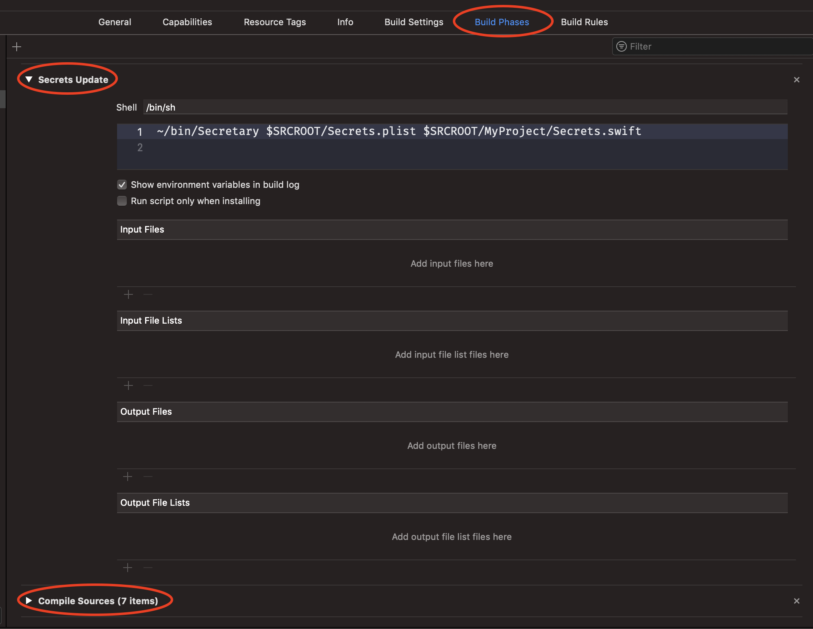

Secretary
=========

Tool that makes easy to store API keys outside of repository.

Usage
-----

```
Secretary </path/to/secrets.plist> </path/to/secrets.swift>
```

It takes two arguments:

1. Path to `plist` file, containing the real secrets.

    **`Secrets.plist`**

    ```xml
    <?xml version="1.0" encoding="UTF-8"?>
    <!DOCTYPE plist PUBLIC "-//Apple//DTD PLIST 1.0//EN" "http://www.apple.com/DTDs/PropertyList-1.0.dtd">
    <plist version="1.0">
    <dict>
        <key>keyOne</key>
        <string>ValueOne</string>
        <key>keyTwo</key>
        <string>ValueTwo</string>
        <key>keyThree</key>
        <string>ValueThree</string>
    </dict>
    </plist>
    ```

2. Path to `swift` file with empty `enum` `Secrets`.

    **`Secrets.swift`**

    ```swift
    enum Secrets {

        static let keyOne = "<<changeme>>"
    }
    ```

The tool changes the values of variables, that names found in `plist` as keys, to corresponding values.

So using with the examples above, after the tool will finish, the file `Secrets.swift` will look like this:

```swift
enum Secrets {

    static let keyOne = "ValueOne"
    static let keyTwo = "ValueTwo"
    static let keyThree = "ValueThree"
}
```

Usage With Xcode
----------------

1. Create the file that contains only namespace `enum Secrets` with the static variables representing the secrets, as in the example above.
2. Create the `plist` file with secrets and exclude it from version control system.
3. Add run script build phase prior to `Compile Sources` phase:

    

    With script like this:

    ```sh
        ~/bin/Secretary $SRCROOT/Secrets.plist $SRCROOT/MyProject/Secrets.swift
    ```

4. Consider to marking your `Secrets.swift` file with `git update-index --assume-unchanged` command, as the real secrets will be added in it on build.

Build/Install
-------------

You should use `make install` command to build and install this tool.

For example, to install it to default location at `/usr/local/bin` just run:

```sh
$ make install
```

You can specify the installation path by setting the variable `INSTALLPATH=~/bin/` like this:

```sh
$ make install INSTALLPATH=\~/bin/
```

TODO
----

- [ ] Support secrets in formats:
    - [ ] `plist`
    - [ ] `json`
    - [ ] `yaml`
- [ ] Add tests.
- [ ] Add `Secrets.swift` generation from scratch.
